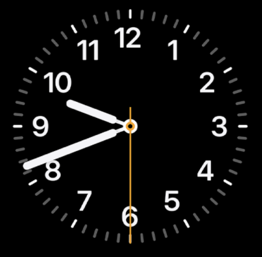
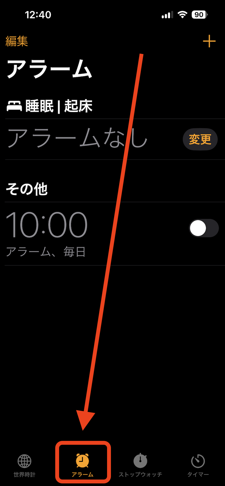
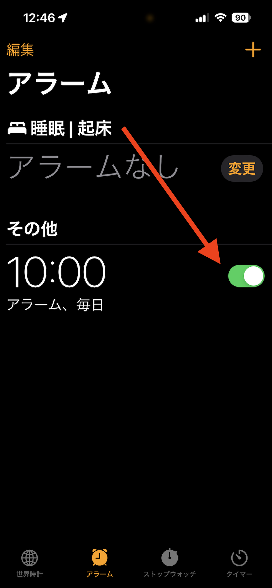
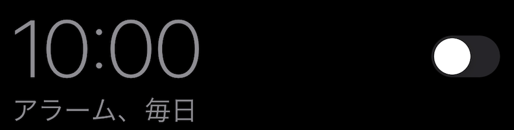
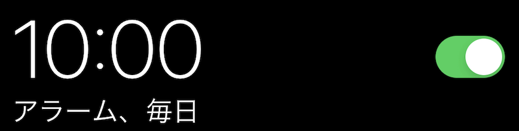
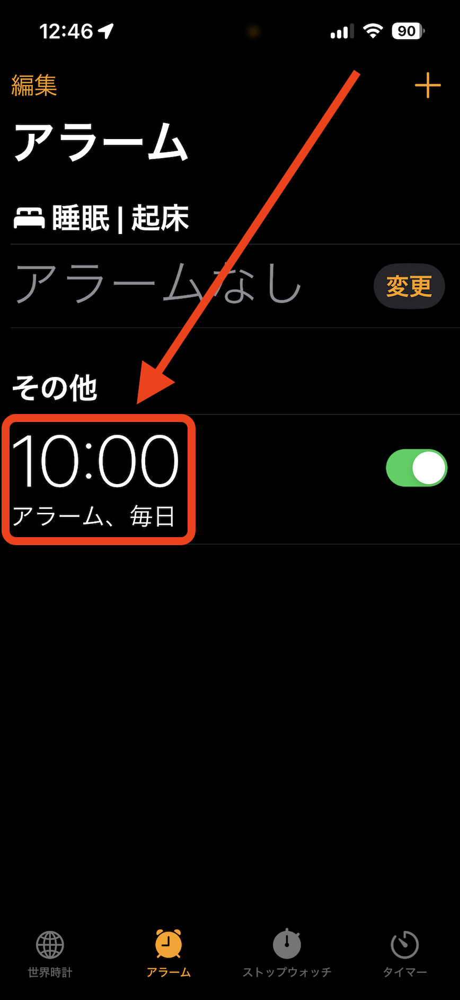
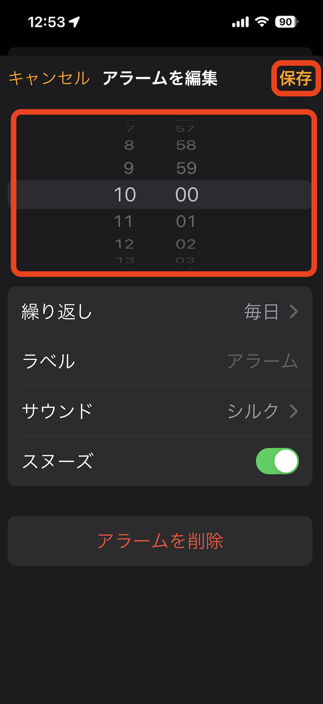

Alarm Clock
==============

Tap the icon labeled 'Clock'.

Tap the icon labeled 'Alarm'.

To set the alarm for tomorrow, turn the switch ON.

The switch will turn green when it's ON.

If you want to change the time for the alarm, tap the time.

Set the time and tap 'Save' in the top right corner.

