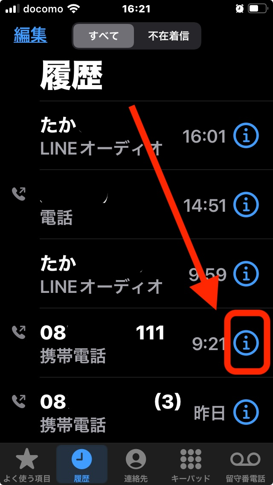
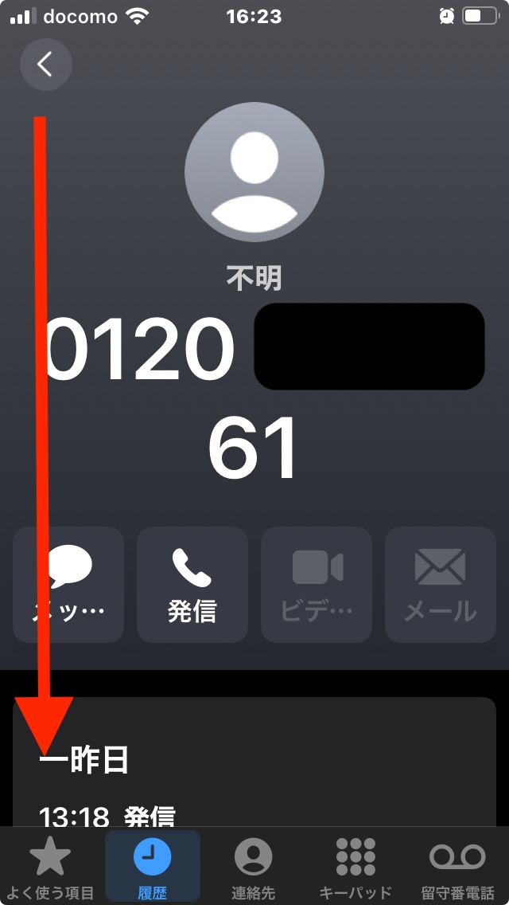
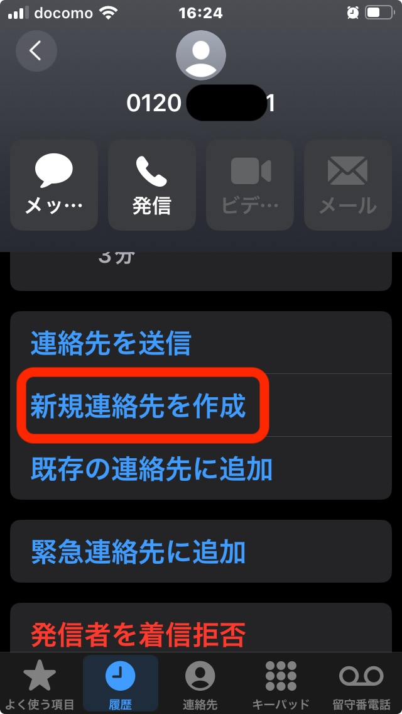
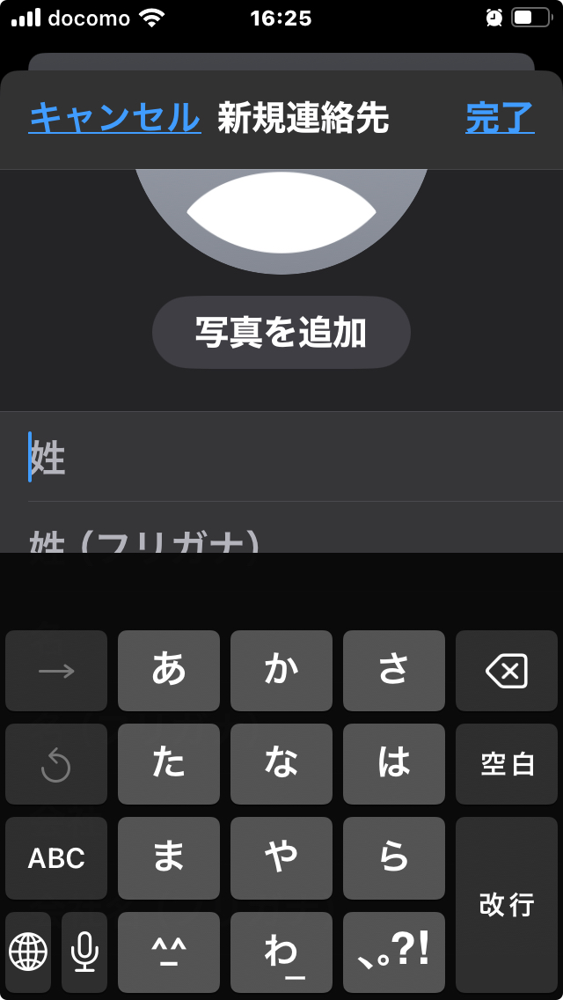
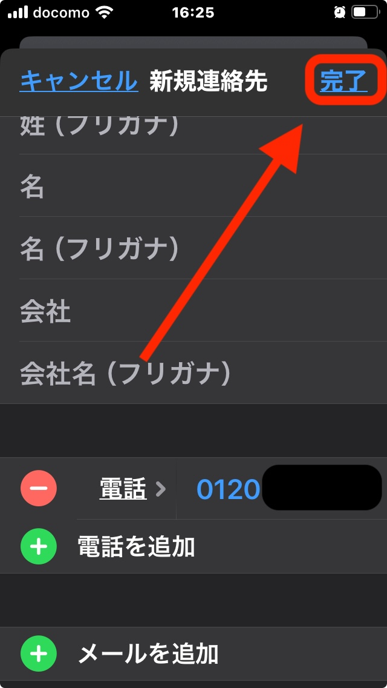

Contacts
============

To register a contact, tap the phone icon.

Tap the 'i' next to the phone number you want to register. Be careful not to tap the number itself, as this will make a call.

Once the detail screen is displayed, please scroll down.

Tap 'Create new contact'.

Please enter the name.

Once you've filled in the necessary fields, tap 'Done' at the top right of the screen.

