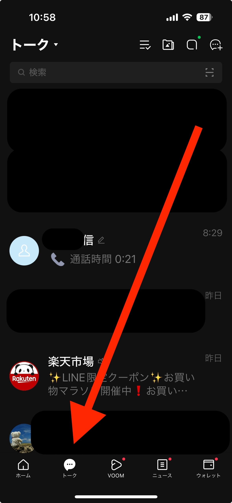
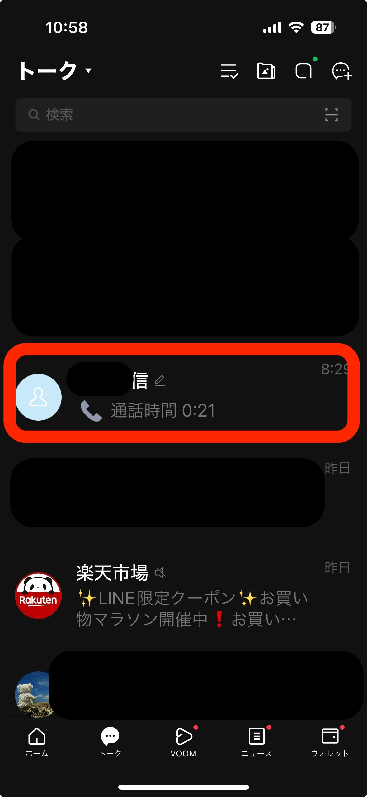
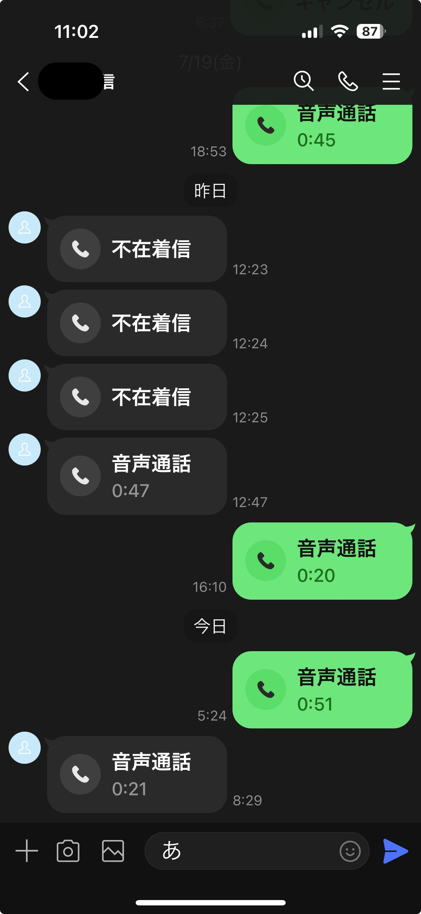
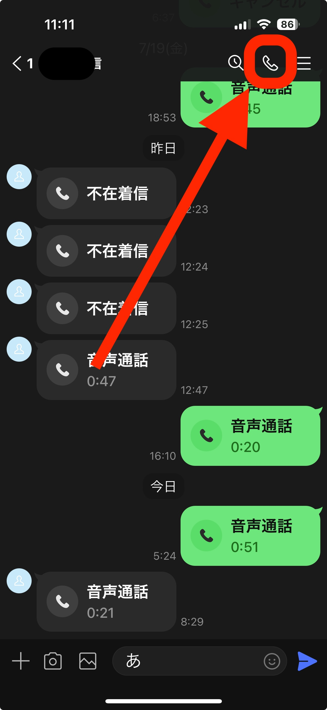
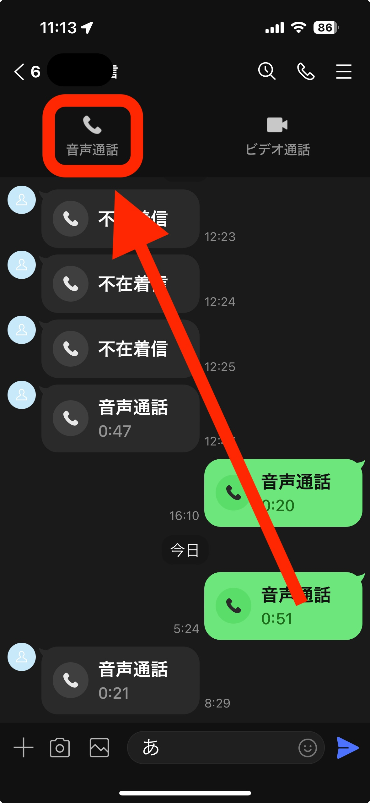
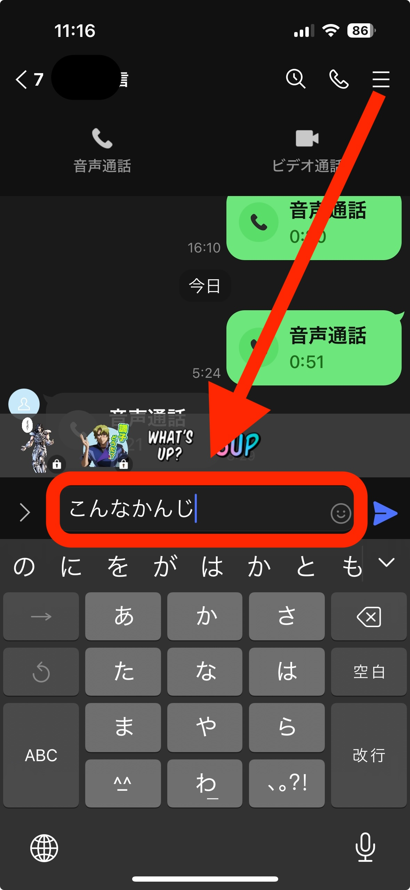
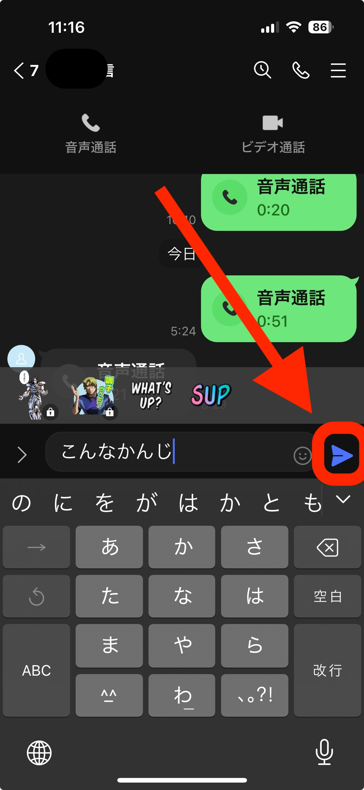

line
==========================================

*************************
How to make a voice call
*************************

Please tap the LINE icon.

Please tap the Chat icon.

Please tap the name of the person you want to call. The chat screen with that persion will open.

Please tap the receiver icon at the top right.

Please tap the displayed voice call option.

*****************
How to chat
*****************

It's almost the same as making a voice call.

Please tap the LINE icon.

Please tap the Chat icon.

Please tap the name of the person you want to call. The chat screen with that persion will open.

Please enter the text you want to send in the text input field at the bottom of the screen.

After finishing the input, please tap the blue arrow on the right side of the screen. The message will be sent to the recipient.

