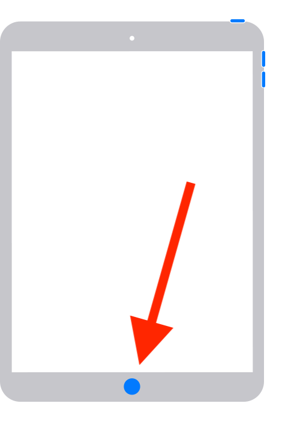
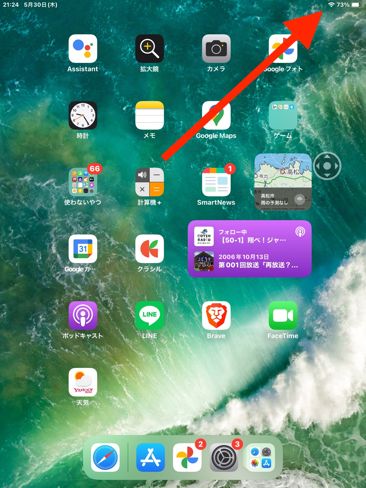
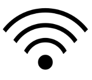
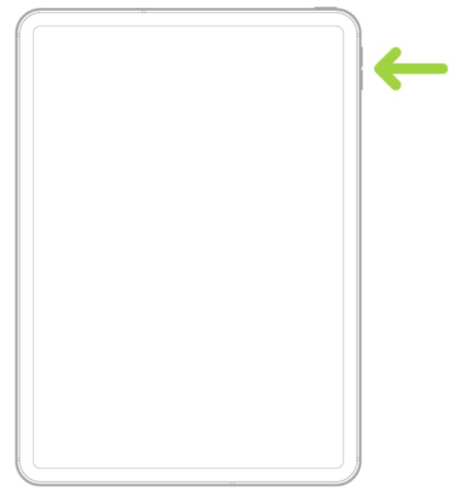

Trouble
============

************************************
You want to display the Home screen
************************************

Please press the round button at the bottom of the iPad (it's called the Home button).

************************************
When you lose internet connection
************************************

When connecting to the internet, you first need to go through a device called a router.

You can check if you are connected to the router by looking at the WiFi icon at the top right corner of the screen.

The image below is an enlarged view of the WiFi icon that was at the top right corner
of the screen.

Please contact me if this icon does not appear.

************************************
I want to adjust the volume
************************************

There are buttons to adjust the volume at the location of the arrow.
