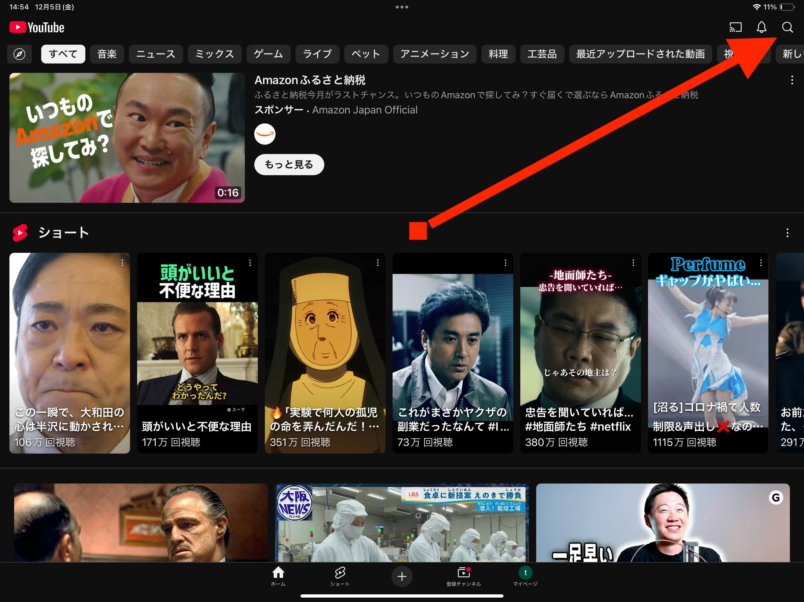
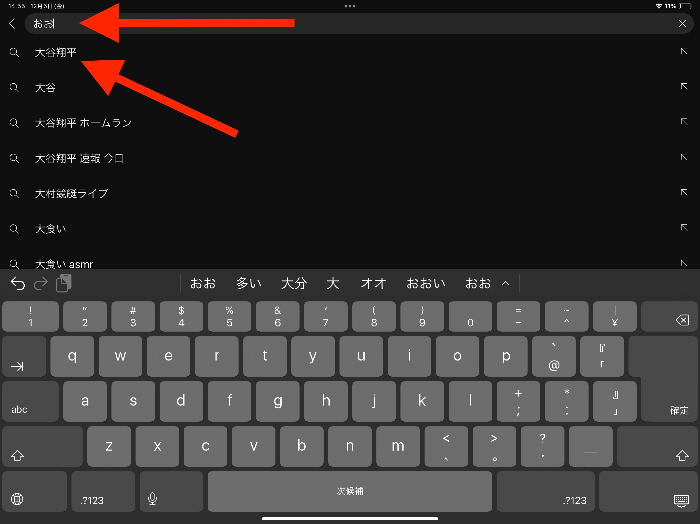
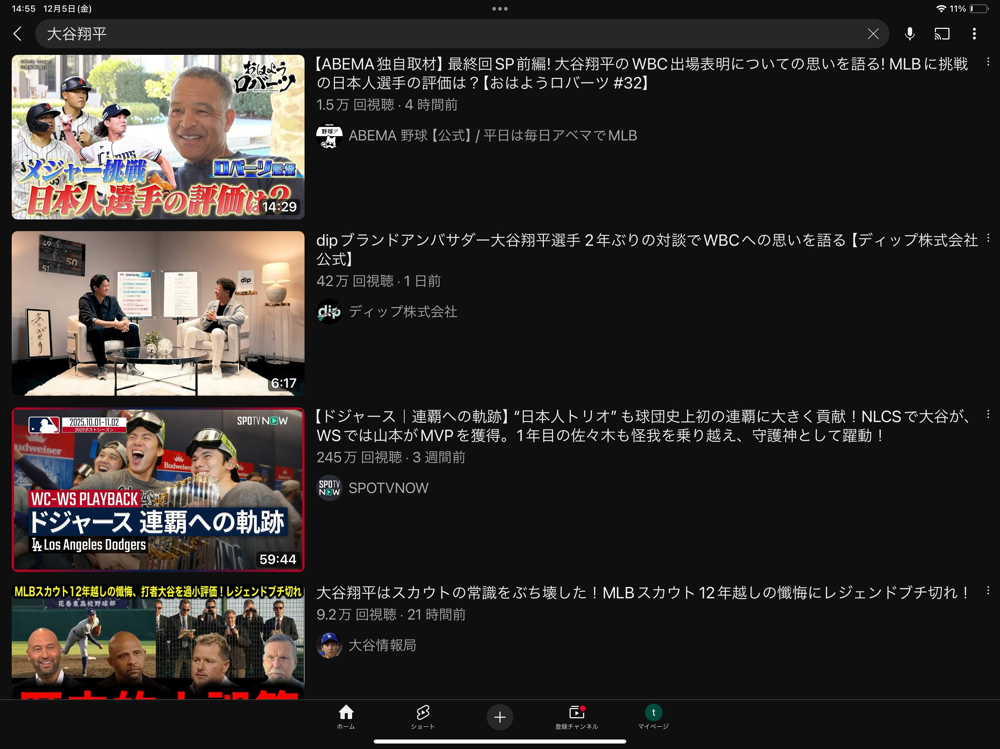

YouTube(動画)を観る
======================

************************************
YouTube icon
************************************

赤いアイコンをタップしてください。

.. image:: ./youtube-icon.png
   :scale: 20%

虫眼鏡のアイコンをタップしてください。

例えば大谷翔平の動画を見たい場合は、入力欄に「おおたにしょうへい」と入力します。
恐らく途中でおすすめのキーワードが補完されるので、その中から観たい動画をタップします。

すると観たい動画が観れます。

